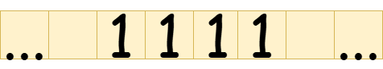

# Turing Machine States

To understand Turing machine states, an example is usually very helpful.&#x20;

Suppose we are using the following representation convention:

> To represent a number $$n\in\mathbb{Z}^+$$, repeat the symbol $$1$$ $$n$$ times.

Now suppose you are given the following tape:

<figure><figcaption>
A tape containing the decimal number 4.
</figcaption></figure>

You are tasked with making the tape, after you are done, contain one more tally ($$1$$) than what was originally on it. Specifically, you should add the extra tally to the right of the tallies that were originally on the tape. Also suppose that the only way you can access the tape is through a Turing machine head, which you control by supplying instructions to. The head will originally be stationed at the leftmost tally on the tape (which you can assume is guaranteed to exist). Also assume that there is exactly one contiguous block of tallies on the tape.


In the task description above, we stated that the head will be stationed at the the leftmost tally on the input tape. In Varphi, and in Turing machines in general, this is an assumption that holds. The head of a machine that is described using Varphi will always start at the leftmost tally on the input tape.


A natural way of doing this is as follows:

Read the current tape cell.

* If there is a tally at the current tape cell, write a tally to the current tape cell (leaving it as-is) and move to the tape cell immediately to the right of the current one. Repeat.
* If the current tape cell is blank, write $$1$$ to the current tape cell and move to the tape cell immediately to the right of the current one. Stop.

Now what if the task was to add two tallies instead of just one? Let's try to write a similar algorithm:

Read the current tape cell.

* If there is a tally at the current tape cell, write a tally to the current tape cell (leaving it as-is) and move to the tape cell immediately to the right of the current one. Repeat.
* If the current tape cell is blank, write a tally to the current tape cell and move to the tape cell immediately to the right of the current one. What now??? We still need to add one more tally.

It turns out that we don't have enough expressive power to achieve this task without introducing the concept of _states_.&#x20;

We can think of a Turing machine _state_ as being a "state of mind" of the Turing machine. For the example where we are adding two $$1$$s to the right of a number, we can rewrite the algorithm using states as follows:

Start at state $$q_0$$. Read the current tape cell.

* If we are on state $$q_0$$:&#x20;
  * If there is a tally at the current tape cell, write a tally to the current tape cell (leaving it as-is) and move to the tape cell immediately to the right of the current one. Stay on state $$q_0$$. Repeat.
  * If the current tape cell is blank, write a tally to the current tape cell and move to the tape cell immediately to the right of the current one. Switch to state $$q_1$$. Repeat.
* If we are on state $$q_1$$:
  * If the current tape cell is blank, write a tally to the current tape cell and move to the tape cell immediately to the right of the current one. Switch to state $$q_2$$. Repeat.

We have written our algorithm in a completely unambiguous way. Notice that not every state needs to define rules. For example, $$q_2$$ has no rules, which means it's a halting state (the algorithm terminates if we reach this state). Also, notice that $$q_1$$ defines no rule for if a tally is encountered at the current tape cell, because we do not expect there to be any non-blank tape cell to the right of the tape cell containing the rightmost tally of the input number.&#x20;
