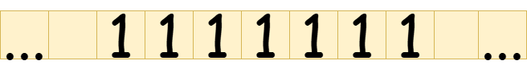
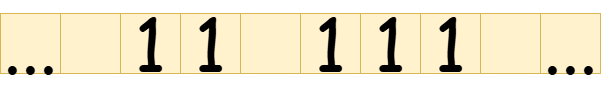

# Turing Machine Tapes

## The Tape

In the context of a Turing machine, the _tape_ is a component that serves as a place to store information. The tape can be thought of as as paper that is divided into squares, which we will refer to as _tape cells_. Each tape cell can either

1. Be left empty
2. Contain a tally (i.e., $$1$$)

A special thing about the tape, and also one of the reasons why Turing machines are strictly _theoretical,_ is that it spans infinitely. That is, there are infinitely many empty tape cells spanning in both directions.

We can use the tape as a means of representing numbers. Since tape cells can only contain the symbol $$1$$ if they are not left blank, we will have to use the unary number system to represent numbers. For example, here's a representation of a tape containing the decimal number $$7$$, assuming the representation convention is to repeat $$1$$ $$n$$ times to represent a number $$n\in\mathbb{Z}^+$$.

<figure><figcaption>
Subsection of a tape whose only contents are the decimal number 7.
</figcaption></figure>

As you can see, we represented the decimal number $$7$$ by writing seven $$1$$s side-by-side. On the left and right of the number are infinite tape cells that are blank.&#x20;

Since we now have access to the concept of blank tape cells on our tape, we can also use such blank tape cells in our representation conventions. For example, here's a representation convention that allows for representing multiple numbers on the tape:

> To represent a multiset of positive integers $$[x_1,x_2,...,x_N]$$, write $$x_1$$ $$1$$s, followed by a blank, followed by $$x_2$$ $$1$$s, followed by a blank, and so on...


We use the terms "a blank tape cell" and "a blank" interchangeably in this text.


Here's a representation of a tape containing the two decimal numbers $$2$$ and $$3$$:&#x20;

<figure><figcaption>
Subsection of a tape containing the decimal numbers 2 and 3.
</figcaption></figure>

## A Note On Representation Conventions

With Turing machines, a restriction is placed on the initial state of the tape. It must contain at least one tally initially. Therefore, when choosing your representation convention for some domain, ensure that all elements of the domain can be represented using at least one tally.
