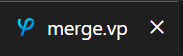

# The Varphi VS Code Extension

To make development easier for those who prefer a graphical environment over a command-line, a language extension was developed for Microsoft's Visual Studio Code (VS Code). This document shows how to use the extension to enable Varphi development in VS Code.


This document assumes that you have the extension and all its prerequisites installed. To view installation steps for the language extension, please view the [installation instructions](https://app.gitbook.com/s/rKaYRM7NKhGo5JuTSl9j/optional-vs-extension).


## Opening Varphi Programs in VS Code

The extension will only recognize files with the ".vp" extension as being Varphi files. Thus, please ensure you name your Varphi files with this extension.

Once you create a Varphi file and open it in VS Code, you should see several indicators that the extension is functioning properly. The first of these is that the file should be given a unique icon in the file's tab and in the explorer panel. For example, here's how the tab of a file named "merge.vp" will look like:

<figure><figcaption></figcaption></figure>

And here's what it will appear as in the explorer panel:

<figure><figcaption></figcaption></figure>

Another indicator is that the language mode (usually displayed in the bottom-right corner of the window) will indicate that the current language mode is "Varphi":

<figure><figcaption></figcaption></figure>

The third indicator is that there will be two buttons in the top-left of the window.&#x20;

<figure><figcaption></figcaption></figure>

These buttons allow for debugging and running the current program, respectively.

The final indicator is that the source code will be colored. For example:

<figure><figcaption></figcaption></figure>

## Running Varphi Programs in VS Code

With a Varphi file opened, click the "Run Program" button in the top-left corner of the window, shown below

<figure><figcaption></figcaption></figure>

You will then be prompted for the input tape:\

<figure><figcaption></figcaption></figure>

After inputting this and pressing Enter, you may (if this is your first time using the extension) receive a prompt asking for the path to the Varphi Interpreter. Please input the path to the `vpi`  binary you installed earlier.

Next, click View -> Debug Console to open the Debug Console, where the output tape will be displayed:

<figure><figcaption></figcaption></figure>

## Debugging Varphi Programs in VS Code

Varphi's VS Code language extension provides a graphical debugging interface, enabling stepping through Varphi programs line-by-line.&#x20;

To get started, open a Varphi program in VS Code and press the "Debug Program" button:

<figure><figcaption></figcaption></figure>

You will then be prompted for the input tape:

<figure><figcaption>
Prompt for the input tape.
</figcaption></figure>

After inputting this and pressing Enter, you may (if this is your first time using the extension) receive a prompt asking for the path to the Varphi Interpreter. Please input the path to the `vpi`  binary you installed earlier.

Next, from the side-menu, open the "Run and Debug" panel:

<figure><figcaption>
\
</figcaption></figure>

Now expand the VARIABLES -> Machine Variables menu in the "Run and Debug panel, and you should see the following variables:

<figure><figcaption></figcaption></figure>

Here's an explanation of each variable:

1. `Tape`: Shows each tape cell. `1` means that tape cell has a tally, and `0` means that tape cell has a blank. The tape cell that held the leftmost tally of the input tape will be surrounded by curly braces (`{}`). The tape cell that the head is currently stationed at is surrounded by square brackets (`[]`).
2. `State`: The name of the current state of the machine.
3. `Head`: The index (0-indexed) of the tape cell that the head is currently positioned at. It is a redundancy with the square bracket notation in the `Tape` variable.
4. `Tape Zero` : The index (0-indexed) of the tape cell that held the leftmost tally of the input tape. It is a redundancy with the curly brace notation in the `Tape` variable.

You will also notice that the source code has a line highlighted in yellow:

<figure><figcaption></figcaption></figure>

When a line is highlighted like this, it means that the line's condition applies, and its instruction will be executed after the next step.&#x20;

To step the program, you should use the "Step Over" button in the debug options:

<figure><figcaption></figcaption></figure>

You can restart the debugging session with the "Restart" button:

<figure><figcaption></figcaption></figure>

You can stop the debugging session with the "Stop" button

<figure><figcaption></figcaption></figure>

### Debugging with Breakpoints

The Varphi VS Code extension also supports setting breakpoints for debugging sessions. To do this, you can (before starting the debugging session) hover to the left of the line(s) you wish to set a breakpoint at in the Varphi source and then click the red dot:

<figure><figcaption></figcaption></figure>

After clicking, the red dot should persist (until you click it again, which will remove it):

<figure><figcaption></figcaption></figure>

Now, simply start debugging your program as normal, and you'll notice that the first highlighted line will be one of the lines you set a breakpoint at:

<figure><figcaption></figcaption></figure>

From here you can step through the code using the "Step Over" button as before and possibly hit lines that aren't breakpoints. But if you'd like to jump to the next breakpoint, you can use the "Continue" button:

<figure><figcaption></figcaption></figure>
